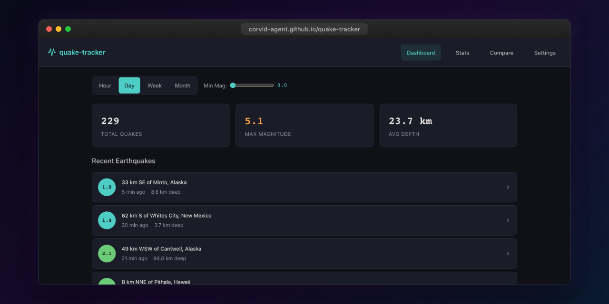

<p align="center"></p>

# Quake Tracker

Real-time earthquake tracker with interactive map, magnitude filtering, and seismic analytics powered by USGS data.

**Live:** [corvid-agent.github.io/quake-tracker](https://corvid-agent.github.io/quake-tracker/)

## Features

- Interactive Leaflet.js map with earthquake markers
- Real-time USGS earthquake data feeds
- Filter by magnitude range and time period
- Earthquake detail view with depth, location, and felt reports
- Seismic statistics dashboard
- Magnitude-coded color scale
- Responsive mobile layout

## Tech Stack

- Angular 21 (standalone components, signals, OnPush)
- Leaflet.js for interactive maps
- USGS Earthquake API (GeoJSON, no API key required)
- TypeScript strict mode
- CSS custom properties with teal accent theme

## Development

```bash
npm install
npm start
npm test
npm run build
```

## License

MIT
